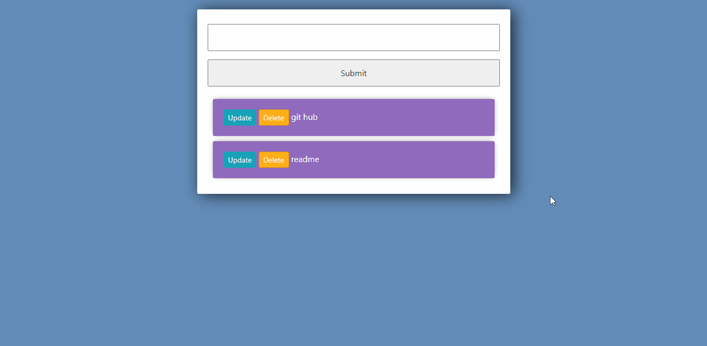

# :rocket: Django To-Do app



### Based on the To-do app [tutorial](https://www.youtube.com/watch?v=4RWFvXDUmjo&t=810s) by Dennis Ivy

This project has only the training goal

## For starters:

Create a folder where your project will be and follow the steps:
- Open the terminal and go to the folder directory
- Clone the repository:
```
git clone repository-url
```
- Create python your virtual environment:
```
python -m venv venv 
```
- Activate your virtual environment (use the git bash):
```
source venv/Scripts/Activate
```
- Install all the requirements:
```
pip install -r requirements.txt
```
- Go to the directory where the manage.py is and run the application:
```
python manage.py runserver
```

## Technologies
- Django
- Python 
- Bootstrap
- HTML and CSS


---
Made with :blue_heart:
